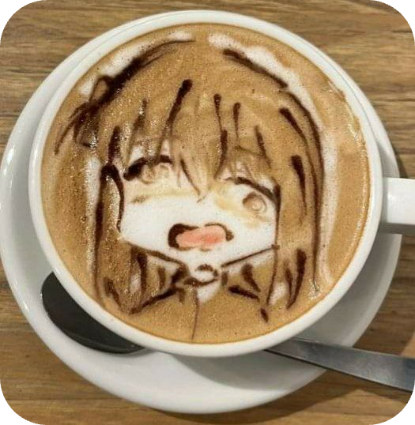

## Henlo! it's a me, Neko!  
konbanwa! it's nice to meet you, I'm NekoMimi  
To be honest I don't even know what I am kekw  
I can be your average artist or your entire IT staff  
My speciality is networking, it's just the most fun thing ever!  
I also am learning low-level fundamentals by writing a VM!  
Former admin at discord.gg/mint  
Am an admin at discord.gg/debian
Really I can be influenced by anything, my projects are completley random but I do have prefrences  

* Contact links at the very bottom ...

### kore wo suki!  
1) Playstation Vita  
2) FOSS projects  
3) Linux  
4) Godot game engine  
5) Vocaloid  
6) Networking :)  
* there are tons more but I can't rember  

### Skills?  
| Language       | Knowledge       |
|--------------- | --------------- |
| Python         |        90       |
| C++            |        70       |
| HTML           |        80       |
| CSS            |       100       |
5x2table
... 

### Abauwt Neko?  
My journey with tech started from windows 95 up till windows 10, I call these days the dark era, used to create VBS scripts and games hacked in batch, it aint much but it made me feel like I achieved something...  
during the dark era (Win XP) I decided to download XAMPP and learn web dev, AND OH DID I CREATE WEBSITES LIKE IT WAS 1990, then I dived into PHP and it turned into my best friend, I remember writing a library for MySQL but it's lost somewhere  
alright, I finally reached windblows 10 .. 1 hour later .. ALRIGHT GUYS WINDBLOWS REALLY BLOWS SO IT'S TIME FOR THE SWITCH! (note that I did use Linux during the dark era but not as much)  
First distro: Tiny core linux (liked it tbh)  
Second distro: DEBIAN!!!! (all time fav till this day)  
Third distro: Kali Linux (what? I was a kid back then!)  
Fourth distro: Ubuntu 20.04 (last good version imo)  
Fifth distro: KDE Neon (OH BOI DIS GORGEUS!!!)  
Sixth distro: Arch32 ( :) )  
Seventh and final distro I'll ever use: NekOS ( :3 )  
* In my distro hop journey I've used debian the most (~2years)  

okay okay.. you already told us the story of your linux life BUT WE WANT YOUR NORMAL DEV STORY!  

Ah.. ahaha.. yes umm.. I just did what I wanted  
after transitioning to linux for good I decided to dive into real programming languages so I started with Python ofc, I spent 2 months creating a Discord bot as my first project, in that time i started working at TechHost as their head SysAdmin managing Docker containers while building discord bots ...  

I think a good while went on like this, I really loved everyone at that place and stayed all time hanging out with them  
Uhh.. (stuff happened..) and "I?" left, welp I can say that the next 2 months were quiet..  
anyways I met "perrypal" I think which I then decided to join one of the servers they were an admin of "The Linux Mint Community" Discord server, now these days I'll call the the age of rising, they have been solid, steadily rising with suckeez (daniel thrasher ref) I started one of my greatest projects, the VDockLite project, it speaks for itself kekw, plus I finally started making other things than bots for once, plus my fabled NekoMimi python module! used in MOST of my projects  
I still feel like I wanna talk about bots tho KEKW (you: YOU POS! {piece of software})  
ok ok.. I'll wrap it up..  
It first started with Celestia, my cutest and most featureful bot (60+ commands including music streaming), I then decided to retire her in favour of a better code-base, which made Serenity rise up.. until i got fed up with creating bots and I just cut her off, and finally when Rapptz the creator of discord.py came back I decided to try it once more, Lotta was born and then gone..  
PS: It's not only my time that was wasted in those last 2 bots, I also drew 3 PFPs for each bot.. fml  

ah yeah, back to my dev journey..  
I started learning Java.. it was crap but I liked the way each class file was compiled into an object.. that's it  
AND THEN I SAID DUCK IT, LET'S C++!  
anywhoz, yeah, c++ isn't hard.. dunno maybe I say that cuz I've learned many languages until now (including some which i havent talked about like that time when I tried 32bit assembly), plus it made me really comfy with programming to that part when I decided to create my own.. scratch that.. decided to create my own architecture, my own assembler, my own compiler, later on my own HW (okay it's starting to get unreal now kekw)  
yeah.. I created the OpenNDK project.. revive old coding that was optimized af, that is my goal, plus building a really cool project while Im at it kekw  
At this time my PC broke (physically) and I'm currently in a state where I can't get a new one so Termux has been my friend for a long time (this readme and the OpenNDK project have all been created with termux+nvchad) and well I guess we land at Today, I'm typing this README.md on a shitty 2$ plastic keyboard that is very irritating to type on but hoping that someday I'll afford a PC (kay kay no need simp-athy i get der soon hopfuli)  

The end.
..or not?  

# Links!  
My primary contact method is Discord!  
Discord `nekomimiofficial`  
Telegram `@NekoMimiOfficial`
Instagram `@nekomimiofficial`

kay.. you get it.. it's the same everywhere (yes even PSN) 

However if you'd like to stay in touch or chat with other people who use my projects, maybe submit a bug or a feature request, or simply for the sake of my happiness (PLZ)  
You may join my Discord server (plz)
Neko's Lab -> [invite](https://discord.com/invite/KFwKPmXJAP) 
